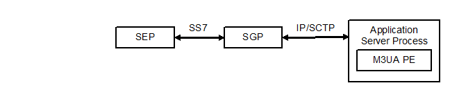
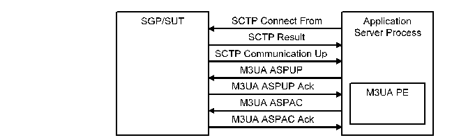

= M3UA Protocol Emulation for TTCN-3 Toolset with TITAN, Function Specification
:author: Ferenc Kovács
:revnumber: 155 17-CNL 113 537, Rev. A
:revdate: 2008-01-14
:toc:

== How to Read this Document

This is the Function Specification for the M3UA Protocol Emulation (M3UA PE). M3UA PE is developed for the TTCN-3 Toolset with TITAN.

== Scope

The purpose of this document is to specify the functionality and configurability of the M3UA PE.

= Overview

It’s necessary to introduce the M3UA PE (working with an SCTP test port and SCTP implementation). The M3UA PE runs on the Application Server Process. It uses a single SCTP test port (with a single SCTP association) to communicate with the SUT. On the other side, the MTP3 users (for example, SCCP, ISUP entities) communicate with the M3UA PE using MTP3 ASPs.

See the place of the M3UA PE below:

= Functional Specification

== Implementation

=== Starting the Emulation

The M3UA PE can be started with the `f_M3UA_Emulation`() function from a TTCN-3 test case. It requires a single parameter of type `SCTP_Association_Address`, which describes the single SCTP association between the SUT and the M3UA PE (on the Application Server Process). The structure looks like the following.

[source]
----
type record SCTP_Association_Address
{
  integer local_sctp_port,
  charstring local_ip_addr,
  integer remote_sctp_port,
  charstring remote_ip_addr
}
----

This information on the SCTP association is stored globally with the actual status of the M3UA PE (stored in the `commStatus` variable). The following scenario (see figure below) shows a usual message flow between the SUT and the M3UA PE, which builds up the SCTP association for M3UA communication in client mode. Only client mode is explained, server mode is similar.

See the building of the SCTP association and the M3UA connection below:

The `commStatus` changes appropriately. At first the M3UA PE is in `aSP_Down_initial_State`, but it changes to `aSP_Down_sCTP_Initialize_Done` immediately. After sending the SCTP Connect From message the state changes to `aSP_Down_sCTP_Associate_done` in case the SCTP Result was not an error message. After reception of the SCTP Communication Up message from the SUT (`aSP_Down_commUP_Received`), the M3UA PE sends a M3UA ASPUP message, waits for an M3UA ASPUP Ack message, and goes to `aSP_Down_ASPUP_Sent` state. The M3UA PE becomes `aSP_Inactive` after receiving the M3UA ASPUP Ack message, and sends a M3UA ASPAC message (`aSP_Inact_ASPAC_Sent`). Finally, after the reception of M3UA ASPAC Ack the state becomes `aSP_Active`. At this point the SCTP association and the M3UA connection is up and running.

=== Initialization

The SCTP part must be initialized with the `f_initialize_SCTP`() function. Setting the module parameters (described in <<_3, [3]>>) is not part of this initialization process, they’re already set at this point via config file parameters. If the M3UA PE runs in server mode an `ASP_SCTP_Listen` message will be sent out to the SUT, otherwise the association will be built (an `ASP_SCTP_ConnectFrom` message will be sent) and a timer (`T_Assoc_restart`) will be started to detect, if the M3UA PE hasn’t received the appropriate `ASP_SCTP_RESULT` message in response to the `ASP_SCTP_ConnectFrom` message. If this timer expires the M3UA PE will try to reassociate.

For transferring M3UA messages as the payload of SCTP packets, the payload type must be adjusted to `_3 (= M3UA)_`. The `tsp_SCTP_PayloadProtocolID` module parameter represents this value. If this payload protocol identifier is set to `_3 (= M3UA)_`, some M3UA specific timers are started.

* `T_ASPUP_resend` is started in client mode only. If we don’t receive a `PDU_M3UA_ASPUP_Ack` message in response to our PDU_M3UA_ASPUP message we need to resend it.
* `T_ASPAC_resend` is started in client mode only. If we don’t receive a `PDU_M3UA_ASPAC_Ack` message in response to our PDU_M3UA_ASPAC message we need to resend it.
* `T_Heartbeat` is started only if the `tsp_Enable_M3UA_Heartbeat` module parameter is set. If this timer expires, a `PDU_M3UA_Heartbeat` message is sent through the SCTP association to the M3UA peer at the SGP. This message will inform the M3UA peer, that we’re still alive at the M3UA level (SCTP has its own heartbeat mechanism implemented in the kernel).

The M3UA PE transfers non-M3UA protocols (for example, if the `tsp_SCTP_PayloadProtocolID` is `_0 (= unspecified)_`) transparently via SCTP.

=== The Dynamic Part

The dynamic part is implemented in the `f_M3UA_ScanEvents`() function. It’s a simple infinite loop (an alt statement with repeat statements for each alternative), which sends and receives messages.

See M3UA message handling in the table below:

[width="100%",cols="17%,27%,28%,28%",options="header",]
|======================================================================================================================================================
|*Message type* |*Message name* |*Client mode* |*Server mode*
|Transfer |`M3UA_DATA` |Can be sent or received. |Can be sent or received.
.6+^.^|SSNM |`M3UA_DUNA` |Not implemented. |Not implemented.
|`M3UA_DAVA` |Sent in response of a `M3UA_DAUD` message. |Sent in response of a `M3UA_DAUD` message.
|`M3UA_DAUD` |Can be sent or received. A `M3UA_DAVA` is sent back in response. |Can be sent or received. A `M3UA_DAVA` is sent back in response.
|`M3UA_SCON` |Not implemented. |Not implemented.
|`M3UA_DUPU` |Not implemented. |Not implemented.
|`M3UA_DRST` |Not implemented. |Not implemented.
.6+^.^|ASPSM |`M3UA_ASPUP` |Sent by the client. |Received from the client. A `M3UA_ASPUP_Ack` is sent to the client.
|`M3UA_ASPUP_Ack` |Received from the server in response of a `M3UA_ASPUP` message. |Sent to the client in response of a `M3UA_ASPUP` message.
|`M3UA_ASPDN` |Can be sent or received. A `M3UA_ASPDN_Ack` is sent back in response. |Can be sent or received. A `M3UA_ASPDN_Ack` is sent back in response.
|`M3UA_ASPDN_Ack` |Not implemented. |Not implemented.
|`M3UA_BEAT` |Can be sent or received. An `M3UA_BEAT_Ack` is sent back in response. |Can be sent or received. An `M3UA_BEAT_Ack` is sent back in response.
|`M3UA_BEAT_Ack` |Sent in response of a `M3UA_BEAT` message. |Sent in response of a `M3UA_BEAT` message.
.4+^.^|RKM |`M3UA_REG_REQ` |Not implemented. |Not implemented.
|`M3UA_REG_RSP` |Not implemented. |Not implemented.
|`M3UA_DEREG_REQ` |Not implemented. |Not implemented.
|`M3UA_DEREG_RSP` |Not implemented. |Not implemented.
.4+^.^|ASPTM |`M3UA_ASPAC` |Sent by the client. |Received from the client. A `M3UA_ASPAC_Ack` is sent to the client.
|`M3UA_ASPAC_Ack` |Received from the server in response of a `M3UA_ASPAC` message. |Sent to the client in response of a `M3UA_ASPAC` message.
|`M3UA_ASPIA` |Can be sent or received. A `M3UA_ASPIA_Ack` is sent back in response. |Can be sent or received. A `M3UA_ASPIA_Ack` is sent back in response.
|`M3UA_ASPIA_Ack` |Not implemented. |Not implemented.
.2+^.^|MGMT |`M3UA_ERR` |Not implemented. |Not implemented.
|`M3UA_NOTIFY` |Not implemented. |Not implemented.
|======================================================================================================================================================

The M3UA PE connected to the MTP3 user via the `MTP3_SP_PORT` port. From the MTP3 user only `ASP_MTP3_TRANSFERreq` messages can be received. If the SCTP association and the M3UA connection between the SUT and the M3UA PE is not already up (the state is not `aSP_Active`), these messages will be buffered. After the association becomes ready (the state changes to `aSP_Active`) these messages will be sent out. The `MTP3_SP_PORT` is used for receiving `ASP_MTP3_TRANSFERreq` messages from the MTP3 user, and for sending `ASP_MTP3_TRANSFERind` messages to the MTP3 user. Sending `ASP_MTP3_PAUSE`, `ASP_MTP3_RESUME`, `ASP_MTP3_STATUS` messages is not yet supported.

The communication with the SUT is done via the configured SCTP association. The M3UA peer from the SGP sends the M3UA PE M3UA messages embedded in SCTP packets. These packets are received on the `SCTP_PORT`.

If the SCTP protocol identifier is set to `_3 (= M3UA)_`, M3UA PE emulates M3UA protocol and maintains static SCTP connectivity with the SUT. M3UA PE implements transfer messaging for MTP3 primitives as well as various management procedures (for example, ASPSM, ASPTM, MGMT). Non-M3UA protocols are transferred transparently via SCTP. The SCTP protocol identifier is used to choose between M3UA and non-M3UA protocols.

Depending on the actual mode (client or server), different kinds of M3UA messages can be received and sent. For example, the M3UA PE can’t receive `M3UA_ASPUP` messages if it is in client mode, and the M3UA PE can’t receive `M3UA_ASPUP_Ack` messages if it is in server mode. The table above shows, how M3UA messages are handled in both modes. "Not implemented" means, that the given message is just logged, M3UA PE doesn’t process it.

== Logging

The type of information will be logged can be categorized into the following groups. In most cases the `tsp_logVerbose` module parameter must be set (see <<_3, [3]>>) to make the log messages appear in the log files.

* Log messages from the SCTP test port.
* Changes in the state of the SCTP association.
* The type of the message received, and the type of the message sent back in response if any.
* If a message of a given type was received in an inappropriate state of the SCTP association, or in an inappropriate mode (client or server).

== Limitations

* Only a single SCTP association is supported between two endpoints. For example we can connect an IP1 and PORT1 pair to an IP2 and PORT2 pair.
* Sending `ASP_MTP3_PAUSE`, `ASP_MTP3_RESUME`, `ASP_MTP3_STATUS` messages is not supported.
* Multi-homing is not supported.

= Terminology

*Protocol Emulation*: +
An instance which implements messages and dynamic behavior of a given protocol layer.

= Abbreviations

ASP:: Abstract Service Primitive

M3UA:: MTP3 User Adaptation

M3UA:: PE M3UA Protocol Emulation

MTP3:: Message Transfer Part Level 3

PE:: Protocol Emulation

SCTP:: Stream Control Transmission Protocol

SEP:: SS7 Signalling End Point

SGP:: Signalling Gateway Process

SS7:: Signalling System 7

SUT:: System Under Test

TTCN-3:: Testing and Test Control Notation Version 3

= References

[[_1]]
[1] Programmer’s Technical Reference for the TITAN TTCN-3 Test Executor

[[_2]]
[2] ETSI ES 201 873-1 V3.2.1The Testing and Test Control Notation version 3. Part 1: Core Language

[[_3]]
[3] M3UA Protocol Emulation for TTCN-3 Toolset, User Guide

[[_4]]
[4] IETF https://tools.ietf.org/html/rfc3332[RFC 3332] +
Signaling System 7 (SS7) Message Transfer Part 3 (MTP3) – User Adaptation Layer (M3UA)
